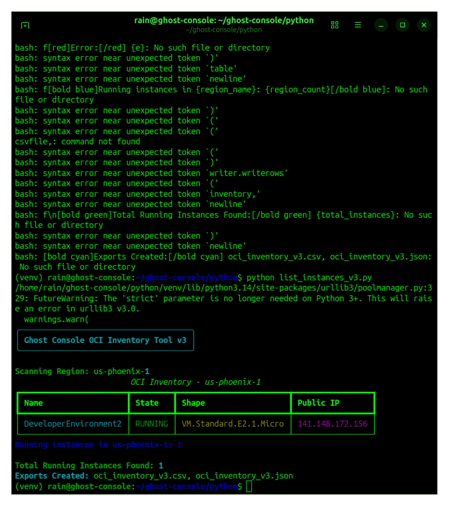
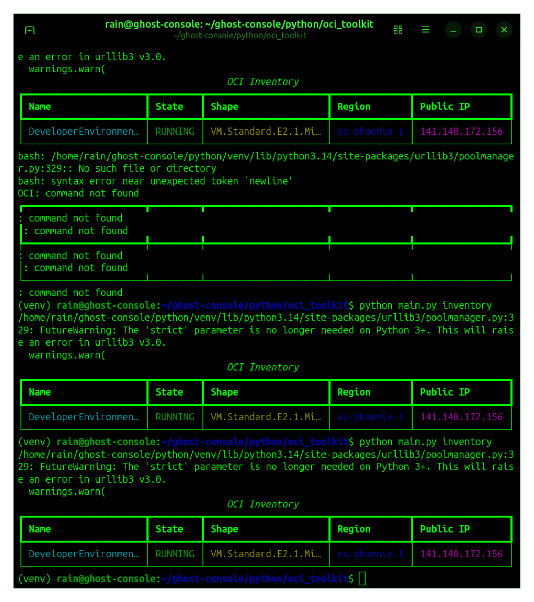
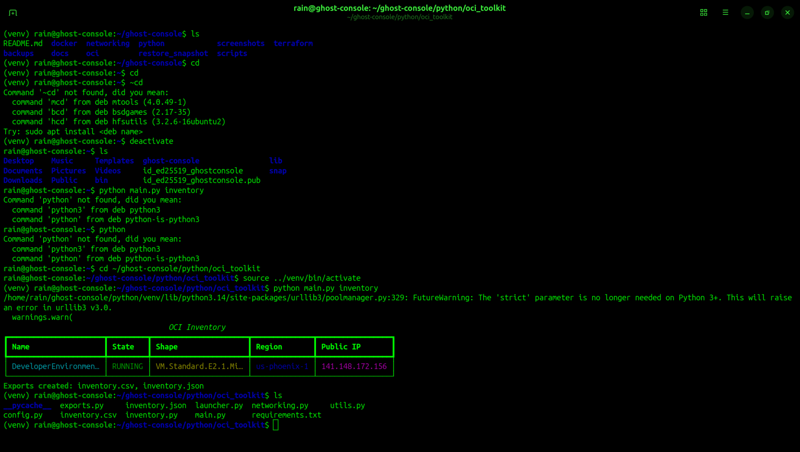

# Ghost Console Beta+

Portable Linux cloud engineering workstation built from salvaged hardware.

---

# Overview

Ghost Console is a rebuilt Dell Latitude 7480 transformed into a cloud automation and infrastructure engineering platform focused on:

- Oracle Cloud Infrastructure (OCI)
- Python automation
- Terraform
- Docker
- Linux systems engineering
- Networking diagnostics

---

# Hardware

- Dell Latitude 7480
- Intel i7-6600U
- 20GB DDR4 RAM
- Salvaged HP SSD

---

# Software Stack

- Ubuntu Linux
- OCI CLI
- OCI Python SDK
- Terraform
- Docker
- VS Code
- GitHub SSH
- Wireshark
- Nmap
- tmux
- htop

---

# Stability Fixes

Resolved Ubuntu graphical freezing by:

- Disabling Wayland
- Disabling Intel PSR:
  `i915.enable_psr=0`

---

# Current Projects

## OCI Inventory Tool

Python-based infrastructure inventory utility that:

- Enumerates OCI compartments
- Lists compute instances
- Retrieves public IP addresses
- Displays formatted terminal tables using Rich

---

# Architecture Diagram

```text
                ┌────────────────────┐
                │  Ghost Console     │
                │ Ubuntu Linux       │
                └─────────┬──────────┘
                          │
        ┌─────────────────┼─────────────────┐
        │                 │                 │
 ┌──────▼──────┐   ┌──────▼──────┐   ┌──────▼──────┐
 │ Python SDK  │   │ Terraform   │   │ Networking  │
 │ OCI Scripts │   │ OCI Deploy  │   │ Diagnostics │
 └─────────────┘   └─────────────┘   └─────────────┘
                          │
                  ┌───────▼────────┐
                  │ Oracle Cloud   │
                  │ Infrastructure │
                  └────────────────┘
```

---

# Repository Structure

```text
ghost-console/
├── python/
├── terraform/
├── docker/
├── networking/
├── docs/
├── screenshots/
└── scripts/
```

---

# Screenshots

## Fastfetch


## OCI Inventory Tool


## VS Code Workspace


---

## OCI Toolkit v2



---

## OCI Toolkit v3



---

## Export Reporting


---

# Future Goals

- OCI instance launcher
- Terraform infrastructure deployment
- Dockerized automation tooling
- Monitoring dashboard
- Multi-region inventory scanning

---

# Author

Carly Titus-El (Rain)
